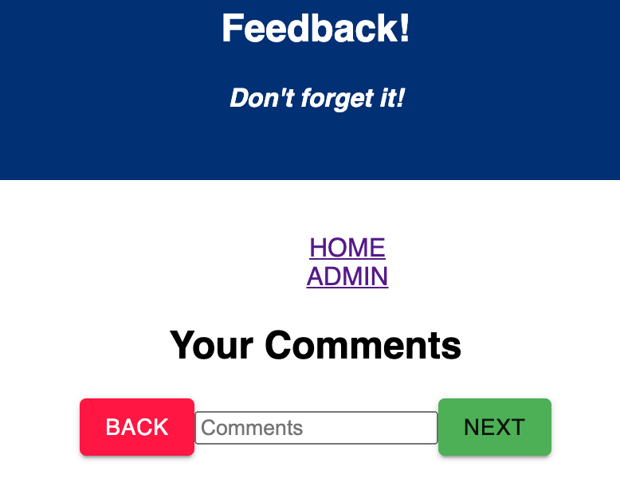

# Redux Feedback Loop

## Your Personality is our Greatest Asset

_Duration: 20hrs_

We value you as a person who is part of our organization. At my company we believe that the strength of our company is the strength of our relationships. Help us strengthen our relationship with you, each day, by letting us ask you a series of questions that query your feelings of the company and the feelings of yourself.



### Prerequisites

- [Node.js](https://nodejs.org/en/)
- [React.js](https://reactjs.org/)
- [React-Redux] (https://react-redux.js.org/)

### SETUP

Create your database and tables using the provided `data.sql` file. Start the server.

```
npm install
npm run server
```

Now that the server is running, open a new terminal tab with `cmd + t` and start the react client app.

```
npm run client
```

## Tell Us What's on Your Mind

1. At the HOME page, You will be presented with your first question. Tell us how you are feeling today, on a scale of 1-5. One your feeling is inserted into the input field, click `NEXT` to be presented the next question. To return to a prior question, click `BACK`
2. Your feedback transaction concludes with a Review Page: You can view your feedback article and if you are satisfied with your article, click `SUBMIT FEEDBACK`
3. Feel Free to submit feedback as often as you like.

## Acknowledgement
Thanks to [Prime Digital Academy](www.primeacademy.io) who equipped and helped me to make this application a reality. Thank you https://github.com/zuberabdikadir, https://github.com/jbird55044, https://github.com/Cassen999: for showing me the mechanics of redux. Thank you https://github.com/freder48: for finding my bugs with your speedy eyes.
## Support
If you have suggestions or issues, please email me at [jkado@my.hpu.edu](www.google.com)
